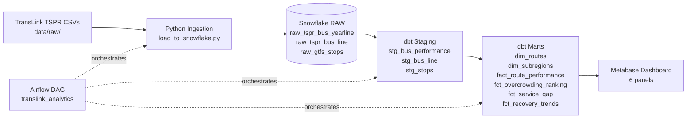

# TransLink Transit Analytics

An end-to-end data pipeline and analytics project analyzing Metro Vancouver's public bus performance data (2019–2024).

**Core question:** *Which bus routes face the greatest service gap between ridership demand and capacity, and how has the overcrowding crisis evolved from pre-pandemic through recovery?*

---

## Key Findings

- **Overcrowding is structural, not cyclical.** A core set of routes appears in the top 20 most overcrowded every year — the same corridors are failing riders year after year regardless of broader system recovery.
- **Ridership has not returned to pre-pandemic levels system-wide** — yet overcrowding on specific corridors is at record highs. Total boardings are down, but demand is concentrated on fewer routes, creating localized capacity crises.
- **Southeast (Surrey/Langley) carries the highest service gap.** It is the fastest-growing sub-region in Metro Vancouver and consistently scores highest on the composite gap score — overcrowding frequency, peak load pressure, and capacity utilization combined.
- **In 2024, 11.2% of all bus trips exceeded capacity** — 137,000 overcrowded trips system-wide. With Vancouver hosting FIFA World Cup 2026 matches, capacity pressure on already-strained corridors will be unprecedented.

---

## Architecture



---

## Tech Stack

| Layer | Tool | Notes |
|---|---|---|
| **Warehouse** | Snowflake | Free trial. Database: `TRANSLINK_ANALYTICS`, schemas: `RAW` / `STAGING` / `ANALYTICS` |
| **Transformation** | dbt Core 1.11 + dbt-snowflake 1.8 | Staging views + mart tables. 52 tests total. |
| **Orchestration** | Apache Airflow 2.7 | Dockerized LocalExecutor. 8-task DAG with data quality gate. |
| **Visualization** | Metabase | Self-hosted via Docker. Connects to Snowflake ANALYTICS schema. |
| **Ingestion** | Python 3.11 | `snowflake-connector-python`, PUT + COPY INTO pattern |
| **Containerization** | Docker + Docker Compose | Airflow + Metabase + PostgreSQL all in one compose file |

---

## Data Sources

| Source | Description | Years |
|---|---|---|
| [TransLink TSPR Yearline](https://www.translink.ca/plans-and-projects/managing-the-transit-network/transit-service-performance-review) | Route-level annual KPIs: boardings, revenue hours, overcrowding %, on-time %, speed | 2019, 2022, 2023, 2024 |
| TransLink ArcGIS Bus Line | Route metadata: subregion, service type, name | 2019, 2022, 2023, 2024 |
| [TransLink GTFS](https://www.translink.ca/about-us/doing-business-with-translink/app-developer-resources/gtfs) | Stop locations for geographic context | Static |
| Census 2021 | Sub-region population + area (seed CSV) | 2021 |

---

## Project Structure

```
translink-transit-analytics/
├── data/raw/                        # gitignored — manually downloaded CSVs
├── ingestion/
│   └── load_to_snowflake.py         # PUT + COPY INTO all raw tables (idempotent)
├── dbt/
│   ├── models/
│   │   ├── staging/                 # Clean + type-cast raw data (views)
│   │   └── marts/                   # Analytics-ready tables
│   ├── seeds/
│   │   └── subregion_population.csv # 8 Metro Vancouver sub-regions
│   ├── macros/                      # parse_combined_route, generate_schema_name
│   └── tests/                       # Custom data quality tests
├── airflow/
│   ├── docker-compose.yml           # Airflow + Metabase + PostgreSQL
│   ├── Dockerfile                   # Airflow + dbt-snowflake
│   └── dags/
│       └── translink_analytics_dag.py
└── dashboards/
    └── screenshots/
```

---

## Setup

### Prerequisites
- Docker Desktop
- Snowflake account (free trial) with database `TRANSLINK_ANALYTICS` and schemas `RAW`, `STAGING`, `ANALYTICS`
- TSPR CSV files downloaded to `data/raw/`

### 1. Configure credentials

```bash
cp .env.example .env
# Fill in SNOWFLAKE_ACCOUNT, SNOWFLAKE_USER, SNOWFLAKE_PASSWORD, etc.

cp airflow/.env.example airflow/.env
# Fill in same Snowflake credentials + generate AIRFLOW_FERNET_KEY:
python -c "from cryptography.fernet import Fernet; print(Fernet.generate_key().decode())"
```

### 2. Initialize and start services

```bash
cd airflow

# First run only — initialize Airflow DB and create admin user
docker compose up airflow-init

# Start all services (Airflow + Metabase + PostgreSQL)
docker compose up -d
```

| Service | URL | Credentials |
|---|---|---|
| Airflow | http://localhost:8080 | admin / admin |
| Metabase | http://localhost:3000 | set on first login |

### 3. Trigger the pipeline

In the Airflow UI: enable the `translink_analytics` DAG → click **Trigger DAG**.

Or via CLI:
```bash
docker compose exec airflow-scheduler airflow dags trigger translink_analytics
```

The DAG runs the full pipeline end-to-end:

```
download_check
    ├── load_tspr_to_snowflake ──┐
    ├── load_arcgis_to_snowflake ┤
    └── load_gtfs_to_snowflake ──┴── dbt_seed
                                         │
                                 dbt_run_staging
                                         │
                                 dbt_test_staging  ← quality gate
                                         │
                                 dbt_run_marts
                                         │
                                 dbt_test_marts
                                         │
                                 notify_complete
```

### 4. Connect Metabase to Snowflake

Visit http://localhost:3000 → Add database → Snowflake:
- Database: `TRANSLINK_ANALYTICS`
- Schema: `ANALYTICS`
- Role: `ACCOUNTADMIN`

---

## dbt Models

### Staging (views in `STAGING` schema)
| Model | Description |
|---|---|
| `stg_bus_performance` | All yearline report years unioned + deduplicated (2024 report wins overlaps) |
| `stg_bus_line` | ArcGIS route metadata — subregion, name, service type, cost |
| `stg_stops` | GTFS stops filtered to boardable stops in Metro Vancouver bounding box |

### Marts (tables in `ANALYTICS` schema)
| Model | Description |
|---|---|
| `dim_routes` | One row per route — latest ArcGIS snapshot, COALESCE preserves discontinued routes |
| `dim_subregions` | 8 Metro Vancouver sub-regions with 2021 census population and density |
| `fact_route_performance` | One row per route/year — all KPIs, recovery rate, YoY change, severity tier |
| `fct_overcrowding_ranking` | Ranked by overcrowding % per year; `is_persistent_overcrowded` flags top-20 routes in 3+ years |
| `fct_service_gap` | Composite gap score 0–100 (overcrowding 50%, peak load 30%, capacity utilization 20%) |
| `fct_recovery_trends` | All metrics indexed to 2019 = 100; volume-weighted sub-region rollup |

**Tests:** 52 total (25 staging + 27 marts) — uniqueness, not_null, accepted_values, custom range assertions.

---

## Dashboard

6 panels in Metabase connected to the `ANALYTICS` schema:

| Panel | Insight |
|---|---|
| Persistent Overcrowding Heat Map | Top routes by overcrowding %, pivoted by year with color intensity |
| Service Gap by Sub-Region | Composite gap score ranked by sub-region — Southeast leads |
| Ridership Recovery by Sub-Region | Recovery indexed to 2019=100 — no sub-region has fully recovered |
| Efficiency vs Overcrowding Scatter | Boardings/service-hour vs % overcrowded — identifies priority investment routes |
| Overcrowding: 2023 vs 2024 | Before/after comparison on top 20 routes — measures investment impact |
| On-Time Performance by Sub-Region | Reliability trends across sub-regions and years |

---

## Data License

Data sourced from [TransLink Open Data](https://www.translink.ca/about-us/doing-business-with-translink/app-developer-resources) under the [TransLink Open Data License](https://www.translink.ca/about-us/doing-business-with-translink/app-developer-resources/open-data-license). Population data from Statistics Canada 2021 Census.

---

## About

Built as a portfolio project. I completed a 9-month co-op at TransLink (Jan–Sep 2024) as a Software Test Analyst, building ETL pipelines in Azure Data Factory and Power BI dashboards. This project demonstrates independent work with TransLink's public data using the modern data stack.
